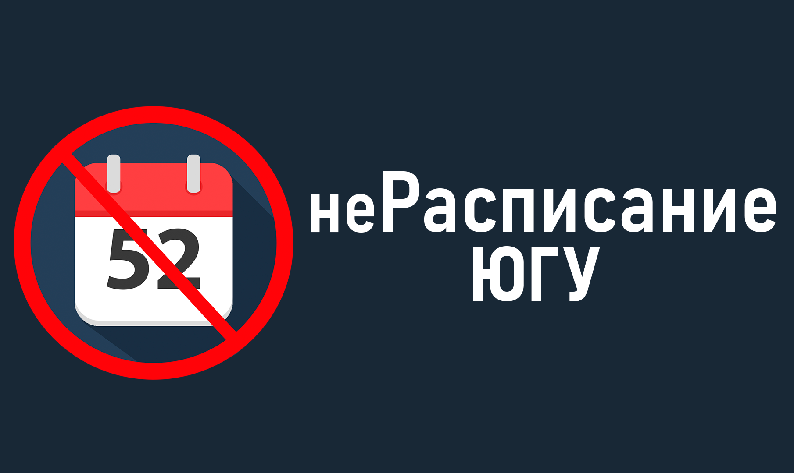

# UGRASU-Schedule


**неРасписание ЮГУ** (notShchedule UGRASU) - a Telegram bot for viewing class schedules at **Ugra State University** and its branches.

Main goals of the project:
 - High perfomance
 - User-friendly interface
 - Open sourse and full transparency

The main programming language of the project is **Python**.

You can find all used framework below. 

# Technologies

| Tool | Description |
|------|--------------|
| 🐍 **Python 3.13.7** | Main programmin language |
| 🤖 **aiogram 3.22.0** | Modern asynchronous framework for Telegram bots |
| 🌐 **requests 2.32.5** | Framework for HTTP requests |
| 🗝️ **python-dotenv 1.1.1** | Used to load environment variables (like tokens and API keys) from a .env file |

# How to build?

This project is **not** and official Telegram bot of Ugra State University (UGRASU). It was created by a student for educational purposes and to help other students.
>⚠️ **You won't be able to run this bot on your own! It uses a closed UGRASU API that is only accessible to authorized users.**

If you want to explore the source code:
```bash
git clone https://github.com/panteleyy/UGRASU-Schedule
```
The code is organized into folders by functionality. You can use it as a base for your own projects - non-commercial use only (see LICENSE.txt file  for details).

# Author
Kirill (panteleey)

# License
**Attribution-NonCommercial-ShareAlike 4.0 International**

https://creativecommons.org/licenses/by-nc-sa/4.0/

See LICENCE.txt file for more details
  
