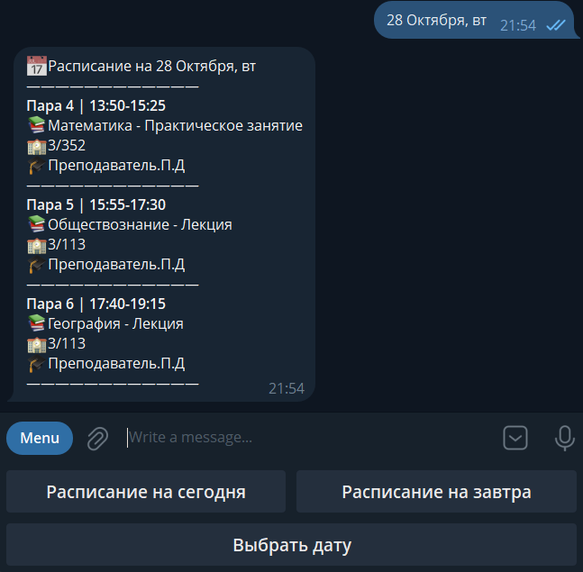

# UGRASU-Schedule


**неРасписание ЮГУ** (notShchedule UGRASU) - a Telegram bot for viewing class schedules at **Ugra State University** and its branches.

Main goals of the project:
 - High perfomance
 - User-friendly interface
 - Open sourse and full transparency

The main programming language of the project is **Python**.

You can find all used framework below. 

# Technologies

| Tool | Description |
|------|--------------|
| 🐍 **Python 3.14.2** | Main programmin language |
| 🤖 **aiogram 3.24.0** | Modern asynchronous framework for Telegram bots |
| 🌐 **aiohttp 3.13.3** | Framework for async HTTP requests |
| 🗝️ **python-dotenv 1.2.1** | Used to load environment variables (like tokens and API keys) from a .env file |

# How to build?

This project is **not** and official Telegram bot of Ugra State University (UGRASU). It was created by a student for educational purposes and to help other students.
>⚠️ **You won't be able to run this bot on your own! It uses a closed UGRASU API that is only accessible to authorized users.**

If you want to explore the source code:
```bash
git clone https://github.com/panteleyy/UGRASU-Schedule
```
The code is organized into folders by functionality. You can use it as a base for your own projects - non-commercial use only (see LICENSE.txt file  for details).

# Functionality & screenshots

- **Faculty and Group Selection**  
  The user selects a faculty and group. After that, the schedule is tied to the selected group by default, and all subsequent requests display the schedule specifically for that group.

- **Viewing Schedule for Any Date**  
  Inline buttons are available for viewing the schedule for today/tomorrow, along with a separate button to display a list of dates for selection.

- **Viewing Teacher Schedules**  
  The user selects a teacher by entering their last name and views their full schedule for the selected date, including groups, classrooms, and types of classes.

- **Theme Customization**  
  Multiple themes are available for displaying the schedule. The selected theme is saved for the user and automatically applied to all subsequent bot messages.

- **Admin Panel**  
  A dedicated admin interface for managing the bot:  
  - Enable/disable the bot (toggle bot availability for users).  
  - Send logs and configuration files via button (quick export of logs and config for debugging or backup).  
  - Ban/unban users (manage user access by banning or unbanning specific user IDs).

### Faculty and group Selection:

  

### Today’s schedule and date selection:

   

### Theme Customization:

   

More screenshots can be found in the `images/` directory inside the repository.


# Author
Kirill (panteleey)

# License
**Attribution-NonCommercial-ShareAlike 4.0 International**

https://creativecommons.org/licenses/by-nc-sa/4.0/

See LICENCE.txt file for more details
  
